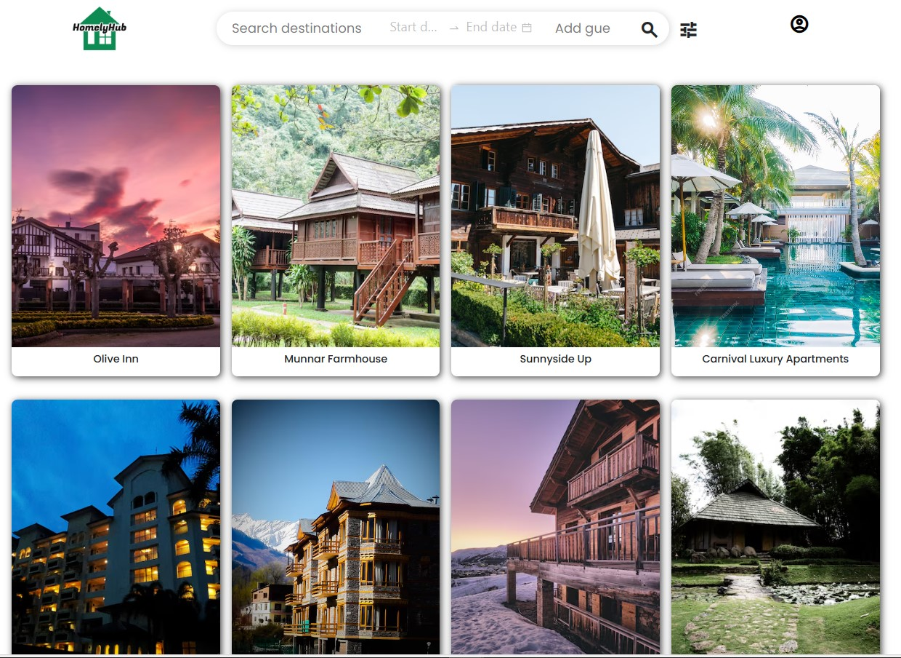

# 🏠 HomelyHub — Property Booking Platform

> A full-stack real-world property listing and booking platform built using the MERN Stack, with AI-powered features for smarter property discovery and trip planning.



## 🌐 Overview

**HomelyHub** is a full-stack property booking web application inspired by real-world accommodation platforms.

The platform allows users to discover properties, view detailed property information, search and filter accommodations, make bookings, manage their profiles and reservations, and interact with AI-powered features for a more personalized travel experience.

The application follows a modern **MERN Stack architecture** with a React frontend, Node.js/Express backend, and MongoDB database.

---

## ✨ Key Features

### 👤 User Authentication & Account Management

- User registration and login
- Secure authentication using JWT
- Password reset functionality
- Update password
- Edit and manage user profile
- Protected routes for authenticated users

### 🏡 Property Management

- Browse available properties
- View detailed property information
- Property images and galleries
- Property amenities
- Property type and room type
- Location and address information
- Interactive map integration
- Hosts can manage their listed accommodations

### 🔎 Search & Filtering

- Search properties by location
- Filter properties based on different criteria
- Pagination for property listings
- Property listing details
- Responsive search experience

### 📅 Booking System

- Select check-in and check-out dates
- Calculate number of nights
- Calculate booking price
- Create property reservations
- View all personal bookings
- View detailed booking information

### 💳 Payment Integration

- Booking payment workflow
- Payment processing interface
- Booking and payment state management
- Integration-ready payment architecture

### 🤖 AI-Powered Features

HomelyHub also includes AI-powered functionality to enhance the user experience.

#### AI Property Description

The application can generate property descriptions using an AI model, helping property owners create descriptive listing content.

#### AI Trip Planner

Users can provide:

- Destination
- Budget
- Number of days
- Number of people
- Travel interests

The AI Trip Planner generates a personalized travel plan containing:

- Trip summary
- Day-wise itinerary
- Travel suggestions
- Useful tips
- Recommended properties

AI functionality is powered through the **Groq API**.

### 📧 Email Functionality

The backend includes email functionality for application workflows such as:

- Password reset
- User communication
- Automated email generation

### 🖼️ Image Management

Property and user images are handled through **ImageKit**, allowing images to be stored externally while the application stores the corresponding image URLs.

### 📱 Responsive UI

The frontend is designed to work across:

- Desktop
- Tablet
- Mobile devices

---

# 🛠️ Technology Stack

## Frontend

| Technology | Purpose |
|---|---|
| React.js | User interface |
| Redux Toolkit | Global state management |
| React Router | Client-side routing |
| Axios | API communication |
| CSS | Styling and responsive design |
| Vite | Frontend development/build tool |
| JavaScript | Application logic |

## Backend

| Technology | Purpose |
|---|---|
| Node.js | Server-side runtime |
| Express.js | REST API framework |
| MongoDB | Database |
| Mongoose | MongoDB object modeling |
| JWT | Authentication |
| Nodemailer | Email functionality |
| Mailgen | Email template generation |
| ImageKit | Image storage/management |
| Groq API | AI-powered functionality |

## Development Tools

- Git
- GitHub
- VS Code
- Postman
- MongoDB
- Gitleaks

---

# 🏗️ System Architecture

```text
                    ┌─────────────────────┐
                    │       User          │
                    └──────────┬──────────┘
                               │
                               ▼
                    ┌─────────────────────┐
                    │   React Frontend    │
                    │      + Redux        │
                    └──────────┬──────────┘
                               │
                         REST API
                               │
                               ▼
                    ┌─────────────────────┐
                    │ Node.js + Express   │
                    │      Backend        │
                    └──────┬──────┬───────┘
                           │      │
                ┌──────────┘      └─────────────┐
                ▼                               ▼
       ┌─────────────────┐             ┌─────────────────┐
       │    MongoDB      │             │ External APIs   │
       │    Database     │             │                 │
       └─────────────────┘             │ • Groq         │
                                       │ • ImageKit      │
                                       │ • Email         │
                                       │ • Maps          │
                                       └─────────────────┘
